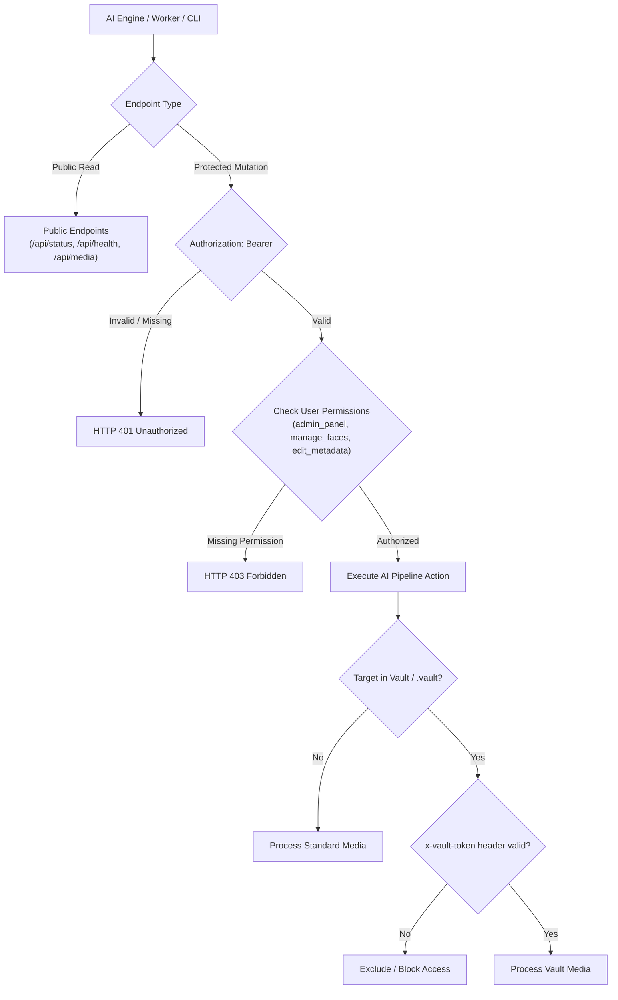

# Developer Guide: Connecting `media_cataloger` AI Engine APIs with Security Rules

This document specifies the communication protocols, authentication headers, permission matrix, secret vault isolation rules, and integration client implementations for connecting the **`media_cataloger` AI Engine** (Python daemon, background workers, or external AI agents) to the `media_cataloger_web` service.

---

## 1. Security Architecture Overview

The system enforces a **Dual-Layer Security Model**:



### 1.1 Permission Matrix for AI Engine

| Permission Key | Description | Required For Endpoints |
| :--- | :--- | :--- |
| `admin_panel` | Execution controls, triggers, and settings | `POST /api/run`, `POST /api/analyze-file`, `POST /api/pause`, `POST /api/resume`, `POST /api/stop`, `POST /api/settings`, `DELETE /api/logs` |
| `edit_metadata` | Ingest descriptions, tags, EXIF & sidecars | `POST /api/media/metadata` |
| `manage_faces` | Register, assign, rename & delete face crops | `POST /api/faces/assign`, `POST /api/faces/rename`, `POST /api/faces/reset`, `DELETE /api/faces/*` |
| `vault_access` | Access private items in `.vault` or tagged folders | `GET /api/media?vault=true`, `POST /api/vault/*`, `GET /api/media/file` (vault items) |

---

## 2. Step-by-Step AI Engine Connection Protocol

### Step 1: Authentication & Token Acquisition
The AI engine must authenticate before executing pipeline tasks or writing results.

- **Endpoint**: `POST /api/auth/login`
- **Headers**: `Content-Type: application/json`
- **Request Body**:
  ```json
  {
    "username": "admin",
    "password": "your_secure_password"
  }
  ```
- **Response**:
  ```json
  {
    "token": "eyJhbGciOiJIUzI1NiIsInR5cCI6IkpXVCJ9...",
    "user": {
      "id": "user_admin_default",
      "username": "admin",
      "displayName": "Administrator",
      "role": "admin",
      "permissions": ["view_media", "edit_metadata", "manage_faces", "admin_panel", "vault_access", "manage_users"]
    }
  }
  ```

> [!TIP]
> Include the returned `token` in all subsequent requests using the header `Authorization: Bearer <token>`. Tokens are valid for 24 hours.

---

### Step 2: Secret Vault Session Initialization (Optional)
If the AI engine is configured to index and analyze files inside private/vault folders (e.g. `secret_vault/` or `.vault/`), obtain a temporary vault session token:

- **Endpoint**: `POST /api/vault/unlock`
- **Headers**:
  - `Authorization: Bearer <JWT_TOKEN>`
  - `Content-Type: application/json`
- **Request Body**:
  ```json
  {
    "pin": "1234"
  }
  ```
- **Response**:
  ```json
  {
    "unlocked": true,
    "sessionToken": "vault_session_8f3a9e2...",
    "expiresAt": 1788265800000
  }
  ```

> [!IMPORTANT]
> Forward the returned `sessionToken` using the header `x-vault-token: <sessionToken>` whenever reading or writing to vault media files.

---

### Step 3: Triggering AI Processing Tasks

#### A. Trigger Full Catalog Sync
- **Endpoint**: `POST /api/run?force=false`
- **Headers**:
  - `Authorization: Bearer <JWT_TOKEN>`
  - `Content-Type: application/json`
  - *(Optional)* `x-vault-token: <VAULT_TOKEN>`
- **Request Body**:
  ```json
  {
    "force": false,
    "output_folder": "/path/to/media_output",
    "settings": {
      "model_provider": "gemini",
      "gemini_model": "gemini-2.5-flash"
    }
  }
  ```

#### B. Trigger Single File Deep Analysis
- **Endpoint**: `POST /api/analyze-file?file=/absolute/path/to/photo.jpg`
- **Headers**:
  - `Authorization: Bearer <JWT_TOKEN>`
  - `Content-Type: application/json`
  - *(Optional)* `x-vault-token: <VAULT_TOKEN>`
- **Request Body**:
  ```json
  {
    "file": "/absolute/path/to/photo.jpg"
  }
  ```

---

### Step 4: Ingesting Analysis Results into Database & Sidecars

When the AI engine finishes extracting metadata, transcripts, visual descriptions, or face crops, it persists the data back to `media_cataloger_web`:

#### A. Save Metadata & Localized Attributes
- **Endpoint**: `POST /api/media/metadata`
- **Headers**:
  - `Authorization: Bearer <JWT_TOKEN>`
  - `Content-Type: application/json`
- **Request Body**:
  ```json
  {
    "file": "/media/photos/IMG_2026.jpg",
    "summary": "Family dinner in living room",
    "summary_ru": "Семейный ужин в гостиной",
    "description": "Group of 4 people having dinner, indoor warm lighting",
    "description_ru": "Группа из 4 человек за ужином, теплое освещение",
    "environment": "indoor",
    "lighting": "warm tungsten",
    "lighting_ru": "теплое освещение",
    "weather": "clear",
    "time_of_day": "evening",
    "time_of_day_ru": "вечер",
    "tags": ["family", "dinner", "celebration"],
    "exif_analysis": "Shot with 50mm f/1.8 lens",
    "transcription": "Happy birthday to you...",
    "transcription_ru": "С днем рождения тебя..."
  }
  ```

#### B. Register Detected Faces
- **Endpoint**: `POST /api/faces/assign`
- **Headers**:
  - `Authorization: Bearer <JWT_TOKEN>`
  - `Content-Type: application/json`
- **Request Body**:
  ```json
  {
    "file": "/media/photos/IMG_2026.jpg",
    "face_id": "face_1788265000_1",
    "person_name": "Alexander",
    "confidence": 0.94
  }
  ```

---

## 3. Python Integration Client

Below is a complete, production-ready Python client implementation for the `media_cataloger` AI engine:

```python
"""
media_cataloger_client.py
Production HTTP client with JWT session management, RBAC, and Secret Vault support.
"""
import time
import requests
from typing import Optional, Dict, Any, List


class MediaCatalogerClient:
    def __init__(self, base_url: str = "http://localhost:3000"):
        self.base_url = base_url.rstrip("/")
        self.session = requests.Session()
        self.token: Optional[str] = None
        self.vault_token: Optional[str] = None
        self.token_expiry: float = 0

    def login(self, username: str, password: str) -> Dict[str, Any]:
        """Authenticate and acquire JWT session token."""
        url = f"{self.base_url}/api/auth/login"
        resp = self.session.post(url, json={"username": username, "password": password}, timeout=10)
        resp.raise_for_status()
        data = resp.json()
        
        self.token = data["token"]
        self.token_expiry = time.time() + (23 * 3600)  # 23h validity
        self.session.headers.update({"Authorization": f"Bearer {self.token}"})
        return data["user"]

    def unlock_vault(self, pin: str) -> str:
        """Unlock Secret Vault session to process private/isolated media."""
        url = f"{self.base_url}/api/vault/unlock"
        resp = self.session.post(url, json={"pin": pin}, timeout=10)
        resp.raise_for_status()
        data = resp.json()
        
        self.vault_token = data["sessionToken"]
        self.session.headers.update({"x-vault-token": self.vault_token})
        return self.vault_token

    def lock_vault(self) -> None:
        """Terminate vault session."""
        if self.vault_token:
            try:
                self.session.post(f"{self.base_url}/api/vault/lock", timeout=5)
            finally:
                self.vault_token = None
                self.session.headers.pop("x-vault-token", None)

    def trigger_full_sync(self, force: bool = False) -> Dict[str, Any]:
        """Trigger whole-archive media processing sync (requires admin_panel)."""
        url = f"{self.base_url}/api/run?force={str(force).lower()}"
        resp = self.session.post(url, json={}, timeout=15)
        resp.raise_for_status()
        return resp.json()

    def trigger_single_analysis(self, file_path: str) -> Dict[str, Any]:
        """Analyze a single media file immediately (requires admin_panel)."""
        url = f"{self.base_url}/api/analyze-file?file={file_path}"
        resp = self.session.post(url, json={"file": file_path}, timeout=15)
        resp.raise_for_status()
        return resp.json()

    def save_metadata(self, file_path: str, metadata: Dict[str, Any]) -> Dict[str, Any]:
        """Ingest AI analysis, tags, and summary into database and sidecars (requires edit_metadata)."""
        url = f"{self.base_url}/api/media/metadata"
        payload = {"file": file_path, **metadata}
        resp = self.session.post(url, json=payload, timeout=10)
        resp.raise_for_status()
        return resp.json()

    def assign_face(self, file_path: str, face_id: str, person_name: str, confidence: float = 1.0) -> Dict[str, Any]:
        """Register a recognized individual face crop (requires manage_faces)."""
        url = f"{self.base_url}/api/faces/assign"
        payload = {
            "file": file_path,
            "face_id": face_id,
            "person_name": person_name,
            "confidence": confidence,
        }
        resp = self.session.post(url, json=payload, timeout=10)
        resp.raise_for_status()
        return resp.json()

    def get_status(self) -> Dict[str, Any]:
        """Get live worker pipeline progress and queue status (Public)."""
        url = f"{self.base_url}/api/status"
        resp = self.session.get(url, timeout=5)
        resp.raise_for_status()
        return resp.json()


# --- Example Usage ---
if __name__ == "__main__":
    client = MediaCatalogerClient("http://localhost:3000")
    
    # 1. Login with service credentials
    user = client.login("admin", "admin")
    print(f"Authenticated as: {user['displayName']} ({user['role']})")
    
    # 2. (Optional) Unlock Secret Vault if analyzing private files
    # client.unlock_vault("1234")
    
    # 3. Analyze a target file
    result = client.trigger_single_analysis("/media_input/vacation_2026/beach.jpg")
    print("Analysis queued:", result)
    
    # 4. Ingest extracted metadata
    client.save_metadata(
        "/media_input/vacation_2026/beach.jpg",
        {
            "summary": "Sunset over the Mediterranean beach",
            "summary_ru": "Закат над пляжем на Средиземном море",
            "environment": "outdoor",
            "time_of_day": "sunset",
            "time_of_day_ru": "закат",
            "tags": ["beach", "sunset", "sea", "vacation"]
        }
    )
    print("Metadata persisted successfully!")
```

---

## 4. Node.js / TypeScript Integration Client

```typescript
import axios, { AxiosInstance } from 'axios';

export class MediaCatalogerApiClient {
  private client: AxiosInstance;
  private token: string | null = null;
  private vaultToken: string | null = null;

  constructor(private readonly baseUrl: string = 'http://localhost:3000') {
    this.client = axios.create({ baseURL: this.baseUrl.replace(/\/+$/, '') });
  }

  async login(username: string, password: string): Promise<any> {
    const res = await this.client.post('/api/auth/login', { username, password });
    this.token = res.data.token;
    this.client.defaults.headers.common['Authorization'] = `Bearer ${this.token}`;
    return res.data.user;
  }

  async unlockVault(pin: string): Promise<string> {
    const res = await this.client.post('/api/vault/unlock', { pin });
    this.vaultToken = res.data.sessionToken;
    this.client.defaults.headers.common['x-vault-token'] = this.vaultToken;
    return this.vaultToken;
  }

  async saveMetadata(filePath: string, metadata: Record<string, any>): Promise<any> {
    const res = await this.client.post('/api/media/metadata', { file: filePath, ...metadata });
    return res.data;
  }

  async assignFace(filePath: string, faceId: string, personName: string, confidence = 1.0): Promise<any> {
    const res = await this.client.post('/api/faces/assign', {
      file: filePath,
      face_id: faceId,
      person_name: personName,
      confidence,
    });
    return res.data;
  }
}
```

---

## 5. Environment Variables Reference

Configure these environment variables for automated services and containers:

| Variable | Default Value | Description |
| :--- | :--- | :--- |
| `CATALOGER_API_URL` | `http://localhost:8000` | Backend Python AI cataloger daemon address |
| `JWT_SECRET` | `media_cataloger_secure_jwt_secret_key_...` | HMAC-SHA256 signing key for auth tokens |
| `AI_SERVICE_USER` | `admin` | Dedicated AI pipeline username |
| `AI_SERVICE_PASSWORD` | `admin` | Dedicated AI pipeline password |
| `VAULT_MASTER_PIN` | `1234` | Master PIN for vault session automation |
| `MEDIA_INPUT_FOLDERS` | `./media_input` | Comma-separated list of monitored input roots |
| `MEDIA_OUTPUT_FOLDER` | `./media_output` | Output location for sidecars, faces, and databases |

---

## 6. Security & Isolation Best Practices

1. **Dedicated Service Account**:
   Create a dedicated service account (e.g. `service_ai_worker`) with the `editor` role and `admin_panel` permission rather than sharing interactive user credentials.
2. **Vault Isolation Guarantee**:
   Media files located inside paths containing `/vault/` or `/.vault/` will never be indexed or processed by external LLMs unless the vault session is unlocked.
3. **HTTP Status Handling**:
   - `401 Unauthorized`: Token expired or missing. Call `client.login()` to refresh credentials.
   - `403 Forbidden`: Account lacks the requisite granular permission (e.g. `manage_faces` or `admin_panel`).
   - `400 Bad Request`: File path is invalid or outside configured `MEDIA_INPUT_FOLDERS`.
