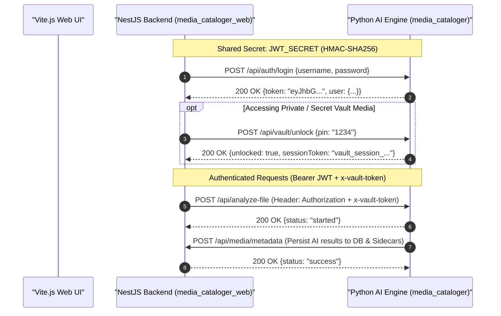
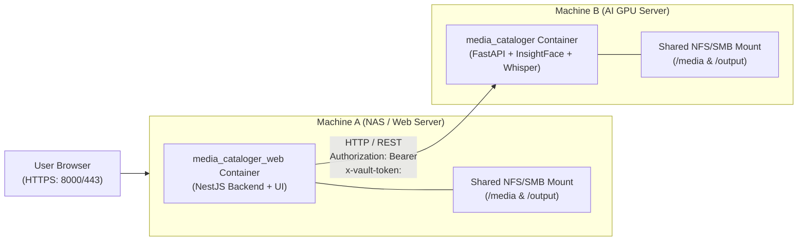

# End-to-End Authentication & Token Configuration Guide

This guide provides step-by-step instructions for establishing a secure, seamless connection between:
1. **`media_cataloger` (AI Engine)**: Python FastAPI daemon handling heavy AI analysis, face embeddings, Whisper transcription, and metadata extraction.
2. **`media_cataloger_web` (Frontend & Web API)**: NestJS REST backend and Vite.js React frontend managing user libraries, face labeling, settings, and media playback.

---

## 1. Security Architecture & Communication Flow



---

## 2. Generating Secrets & Tokens

### A. How to Generate a Strong `JWT_SECRET`
Both services sign and verify tokens using HMAC-SHA256. Generate a cryptographically secure 64-character secret:

- **Linux / macOS / Git Bash**:
  ```bash
  openssl rand -hex 32
  ```
- **Windows PowerShell**:
  ```powershell
  -join ((65..90) + (97..122) + (48..57) | Get-Random -Count 64 | ForEach-Object {[char]$_})
  ```

*Example Output*:
```env
JWT_SECRET=f4b238a9e1d8719c8f037612b4e7829aa89201cd9810ef748301726a8492c10b
```

### B. Token Lifecycle & Roles
1. **JWT Bearer Token**:
   - **Issued by**: `/api/auth/login`
   - **Validity**: 24 hours (86,400 seconds)
   - **Payload**: Contains `username`, `role`, `permissions` (`admin_panel`, `edit_metadata`, `manage_faces`, `vault_access`), `iat`, `exp`.
2. **Secret Vault Session Token (`x-vault-token`)**:
   - **Issued by**: `/api/vault/unlock` upon providing valid `VAULT_MASTER_PIN`
   - **Validity**: Configurable (default 30 minutes / 1800 seconds)
   - **Purpose**: Isolates private directories (`.vault/`, `vault/`, `secret_vault/`) from LLM processing unless explicitly unlocked.

---

## 3. Communication Mode 1: Local Development Build

In local development, both services run directly on your workstation:
- **`media_cataloger` (AI Engine)** on `http://localhost:8001`
- **`media_cataloger_web` (NestJS)** on `http://localhost:8000`
- **`media_cataloger_web` (Vite UI)** on `http://localhost:5173`

### Step 1: Configure Environment Variables

Create or update `.env` in `data/config/.env` or project roots:

#### For `media_cataloger/.env`:
```env
# AI Engine Port & Host
API_PORT=8001
API_HOST=0.0.0.0

# Shared Authentication Keys (Dev Defaults)
JWT_SECRET=dev_secure_jwt_secret_key_change_in_production_2026
AI_SERVICE_USER=admin
AI_SERVICE_PASSWORD=admin
VAULT_MASTER_PIN=1234
VAULT_SESSION_TIMEOUT_SEC=1800

# Input / Output Locations
INPUT_FOLDERS=./media_input
OUTPUT_FOLDER=./media_output
DB_PATH=./media_output/catalog_history.db

# LLM Providers (Gemini / Local LM Studio)
MODEL_PROVIDER=local
LM_HOST=http://localhost
LM_PORT=1234
```

#### For `media_cataloger_web/.env`:
```env
# Web Server Port
PORT=8000

# AI Service Remote Address
CATALOGER_API_URL=http://localhost:8001

# Shared Authentication Keys (Must match media_cataloger)
JWT_SECRET=dev_secure_jwt_secret_key_change_in_production_2026
AI_SERVICE_USER=admin
AI_SERVICE_PASSWORD=admin
VAULT_MASTER_PIN=1234

# Media Paths
MEDIA_INPUT=../media_cataloger/media_input
MEDIA_OUTPUT=../media_cataloger/media_output
DB_PATH=../media_cataloger/media_output/catalog_history.db
```

### Step 2: Start Both Services

1. **Terminal 1 (`media_cataloger`)**:
   ```powershell
   cd c:\Users\rokhl\.gemini\antigravity\scratch\media_cataloger
   .\run.ps1 api
   ```
2. **Terminal 2 (`media_cataloger_web`)**:
   ```powershell
   cd c:\Users\rokhl\.gemini\antigravity\scratch\media_cataloger_web
   .\run.ps1 dev
   ```

---

## 4. Communication Mode 2: Production Build (Docker on Separate Machines)

In production, services run on separate hardware:
- **Machine A (NAS / Web Server)**: Low-power host (e.g. Celeron / 8GB RAM) running `media_cataloger_web` container.
- **Machine B (AI Compute Node)**: Dedicated GPU machine running `media_cataloger` container.



### Step 1: Configure Machine B (`media_cataloger` - AI Engine)

1. Generate a production `JWT_SECRET` and set service credentials.
2. Edit `/DATA/AppData/media-cataloger/config/.env` on Machine B:

```env
# =====================================================================
# MACHINE B: AI Engine Production Config
# =====================================================================
API_PORT=8001
API_HOST=0.0.0.0

# 1. Production Secrets (Keep Private!)
JWT_SECRET=f4b238a9e1d8719c8f037612b4e7829aa89201cd9810ef748301726a8492c10b
AI_SERVICE_USER=service_ai_worker
AI_SERVICE_PASSWORD=VeryStrongProdPassword2026!#
VAULT_MASTER_PIN=9482
VAULT_SESSION_TIMEOUT_SEC=1800

# 2. Storage Paths inside container
MEDIA_INPUT=/app/media_input
MEDIA_OUTPUT=/app/media_output
CONFIG_PATH=/app/data/config

# 3. Model Parameters
MODEL_PROVIDER=gemini
GEMINI_API_KEY=AIzaSy...
GEMINI_MODEL=gemini-2.5-flash
WHISPER_MODEL=large-v3-turbo
WHISPER_DEVICE=cuda
```

3. Launch with Docker Compose on Machine B:
```bash
docker compose -f docker-compose.yml up -d
```

### Step 2: Configure Machine A (`media_cataloger_web` - Web Server)

1. Edit `/DATA/AppData/media-cataloger/config/.env` on Machine A.
2. Ensure `CATALOGER_API_URL` points to **Machine B's LAN IP or hostname** (e.g. `http://192.168.1.150:8001` or `http://ai-server.lan:8001`).
3. Ensure `JWT_SECRET`, `AI_SERVICE_USER`, and `AI_SERVICE_PASSWORD` **match Machine B exactly**:

```env
# =====================================================================
# MACHINE A: Web Server Production Config
# =====================================================================
PORT=8000

# Remote AI Engine address (IP of Machine B)
CATALOGER_API_URL=http://192.168.1.150:8001

# Shared Production Secrets (MUST MATCH MACHINE B)
JWT_SECRET=f4b238a9e1d8719c8f037612b4e7829aa89201cd9810ef748301726a8492c10b
AI_SERVICE_USER=service_ai_worker
AI_SERVICE_PASSWORD=VeryStrongProdPassword2026!#
VAULT_MASTER_PIN=9482

# Storage Mounts
MEDIA_INPUT=/app/media_input
MEDIA_OUTPUT=/app/media_output
CONFIG_PATH=/app/data/config
```

4. Launch with Docker Compose on Machine A:
```bash
docker compose -f docker-compose.yml up -d
```

---

## 5. Implementation Code Examples

### A. Python Client (`media_cataloger_client.py`)
Use this client inside background Python scripts or AI workers:

```python
from media_cataloger_client import MediaCatalogerClient

# Initialize client pointing to production or dev URL
client = MediaCatalogerClient(
    base_url="http://192.168.1.150:8001",
    username="service_ai_worker",
    password="VeryStrongProdPassword2026!#"
)

# 1. Login & acquire JWT token
user_info = client.login()
print(f"Logged in as: {user_info['displayName']} (Permissions: {user_info['permissions']})")

# 2. (Optional) Unlock Secret Vault
client.unlock_vault("9482")

# 3. Ingest AI Metadata
client.save_metadata(
    file_path="/media/photos/IMG_2026.jpg",
    metadata={
        "summary": "Sunset over Mediterranean beach",
        "summary_ru": "Закат над пляжем на Средиземном море",
        "tags": ["sunset", "beach", "vacation"],
        "time_of_day": "sunset",
        "environment": "outdoor"
    }
)

# 4. Trigger Full Archive Sync
client.trigger_full_sync(force=False)
```

### B. TypeScript Client (`mediaCatalogerApiClient.ts` in NestJS)
Use this inside NestJS services to proxy requests to the Python AI daemon:

```typescript
import axios, { AxiosInstance } from 'axios';

export class MediaCatalogerApiClient {
  private client: AxiosInstance;
  private token: string | null = null;
  private vaultToken: string | null = null;

  constructor(
    private readonly baseUrl: string = process.env.CATALOGER_API_URL || 'http://localhost:8001',
    private readonly serviceUser: string = process.env.AI_SERVICE_USER || 'admin',
    private readonly servicePassword: string = process.env.AI_SERVICE_PASSWORD || 'admin'
  ) {
    this.client = axios.create({ baseURL: this.baseUrl.replace(/\/+$/, '') });
  }

  /**
   * Authenticate with AI Engine and cache JWT token
   */
  async ensureAuthenticated(): Promise<string> {
    if (!this.token) {
      const res = await this.client.post('/api/auth/login', {
        username: this.serviceUser,
        password: this.servicePassword,
      });
      this.token = res.data.token;
      this.client.defaults.headers.common['Authorization'] = `Bearer ${this.token}`;
    }
    return this.token!;
  }

  /**
   * Unlock Secret Vault session
   */
  async unlockVault(pin: string): Promise<string> {
    await this.ensureAuthenticated();
    const res = await this.client.post('/api/vault/unlock', { pin });
    this.vaultToken = res.data.sessionToken;
    this.client.defaults.headers.common['x-vault-token'] = this.vaultToken;
    return this.vaultToken!;
  }

  /**
   * Lock Secret Vault session
   */
  async lockVault(): Promise<void> {
    if (this.vaultToken) {
      try {
        await this.client.post('/api/vault/lock');
      } finally {
        this.vaultToken = null;
        delete this.client.defaults.headers.common['x-vault-token'];
      }
    }
  }

  /**
   * Trigger single file analysis
   */
  async analyzeFile(filePath: string): Promise<any> {
    await this.ensureAuthenticated();
    const res = await this.client.post('/api/analyze-file', { file: filePath });
    return res.data;
  }
}
```

---

## 6. Verification Checklist

| Check | Action | Expected Result |
| :--- | :--- | :--- |
| **1. Service Health** | `curl http://<AI_HOST>:8001/health` | `{"status":"ok","service":"media_cataloger"}` |
| **2. Authentication** | `curl -X POST http://<AI_HOST>:8001/api/auth/login -H "Content-Type: application/json" -d '{"username":"admin","password":"admin"}'` | `{"token":"eyJhbG...","user":{...}}` |
| **3. Vault Unlock** | `curl -X POST http://<AI_HOST>:8001/api/vault/unlock -H "Content-Type: application/json" -d '{"pin":"1234"}'` | `{"unlocked":true,"sessionToken":"vault_session_..."}` |
| **4. Vault Isolation** | `curl http://<AI_HOST>:8001/api/media/files` | Lists files excluding `.vault/` items |
| **5. Vault Access** | `curl http://<AI_HOST>:8001/api/media/files?vault=true -H "x-vault-token: <TOKEN>"` | Lists all files including `.vault/` items |
